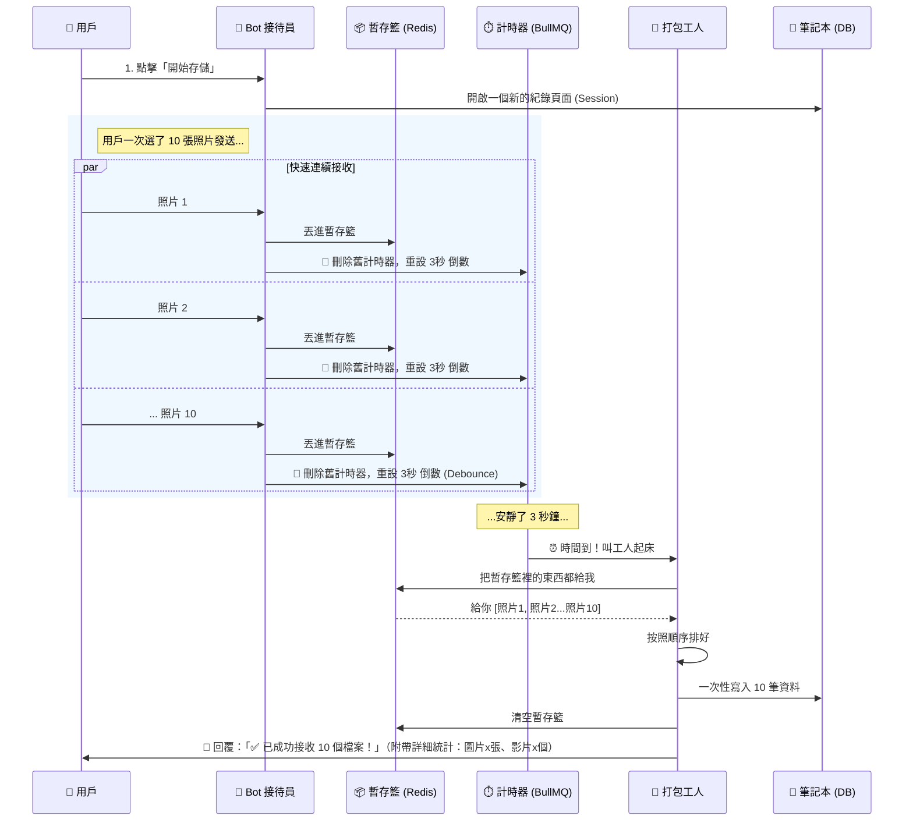
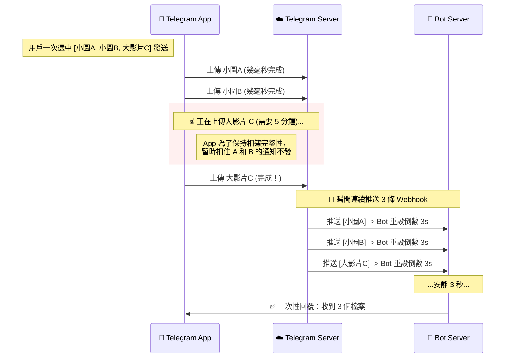
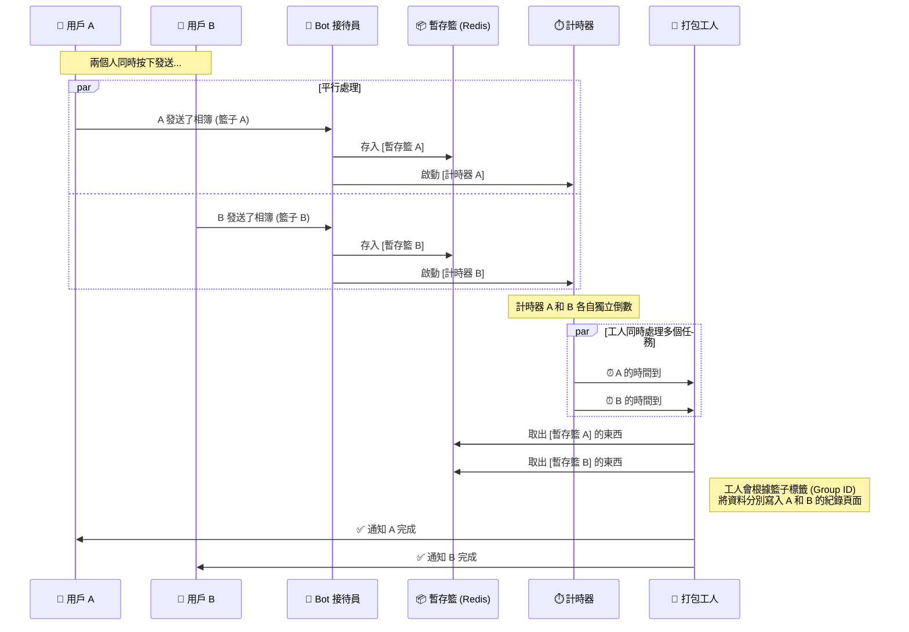
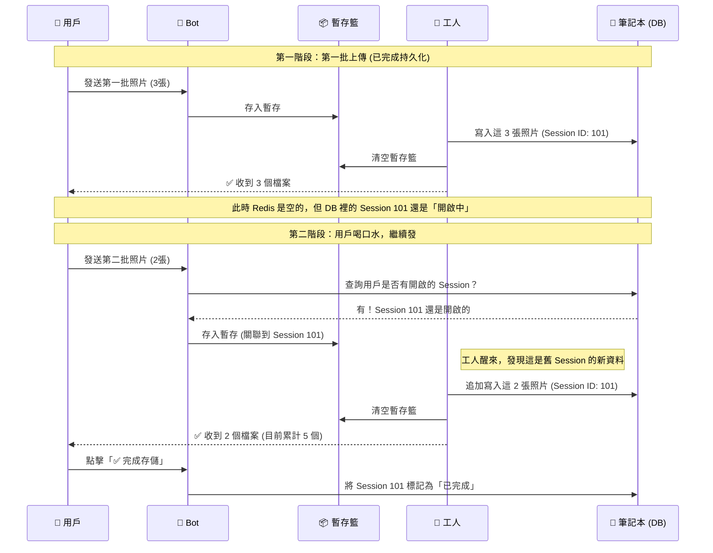
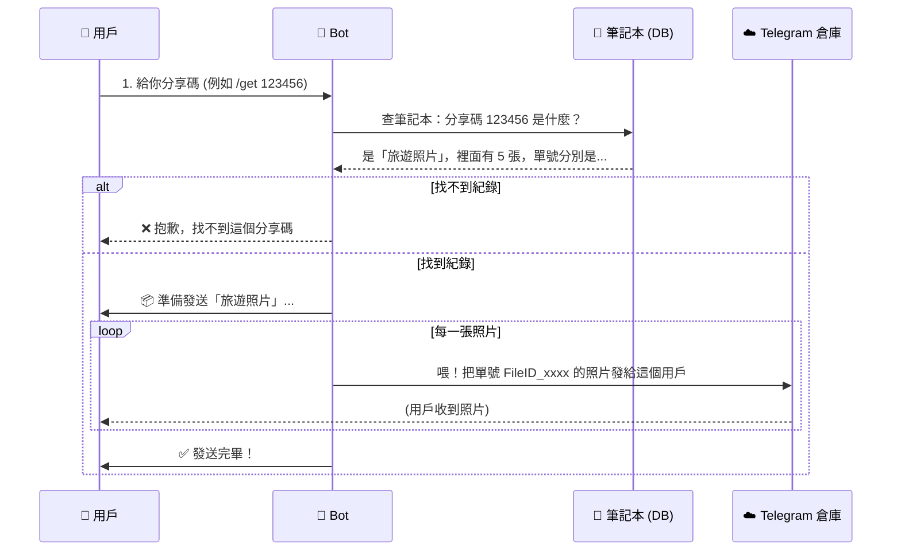

# Telegram Cloud Drive Bot (無限雲端硬碟機器人)

這是一個利用 Telegram 強大基礎設施打造的「無限容量」雲端硬碟。簡單來說，它把 Telegram 當作免費的檔案伺服器，而 Bot 則是一個聰明的圖書管理員，幫你記住每個檔案的位置。

---

## 📖 這是如何運作的？(白話文版)

### 1. 什麼是「虛擬儲存」？(Virtual Storage)

想像 Telegram 是一個巨大的、免費的 **「中央倉庫」**。
當你把檔案發送給 Bot 時，其實檔案已經存進了 Telegram 的倉庫裡。Telegram 會給這張收據一張 **「提貨單號」(File ID)**。

我們的 Bot **不會** 把你的檔案下載到自己的電腦裡（那樣硬碟很快就爆了），它只會把這張 **「提貨單號」** 抄在筆記本（資料庫）上。

- **上傳時**：Bot 收到檔案 ➡️ 記下提貨單號 ➡️ 完成。
- **下載時**：Bot 查筆記本找到單號 ➡️ 告訴 Telegram「請把這個單號的檔案發給用戶」 ➡️ 用戶收到檔案。

這就是為什麼這個 Bot 速度極快且容量無限的原因 —— 因為我們只存文字（單號），不存檔案實體。

### 2. 怎麼處理「相簿」或「多檔發送」？(Media Group Handling)

這是這個專案最核心的技術點。

當你在 Telegram 一次選取 10 張照片發送時，Telegram 其實不是把這 10 張打包成一個包裹給 Bot，而是像 **「發傳單」** 一樣，連續快速地丟 10 個獨立的訊息給 Bot。

如果 Bot 收到一張就處理一張，你的手機就會連續震動 10 次，且資料庫會變得很亂。所以我們設計了一個 **「緩衝區機制」**。

#### 📦 運作流程比喻：

1.  **收集區 (Redis Buffer)**：
    Bot 就像一個收發室員工。當你開始丟照片給他時，他不會馬上歸檔，而是先把它們全部丟進一個 **「暫存籃」** 裡。

2.  **計時器 (Debounce / Delay)**：
    每收到一張照片，員工就會把計時器重置為 **1 秒**。

    - 收到第 1 張... 重置計時 (剩 1 秒)
    - 0.1 秒後收到第 2 張... 重置計時 (剩 1 秒)
    - ...
    - 收到第 10 張... 重置計時 (剩 1 秒)

3.  **打包處理 (Worker)**：
    當計時器終於倒數到 0（代表你發完了，沒有新照片進來了），員工就會把 **「暫存籃」** 裡的 10 張照片一次拿出來，整理好順序，然後一次性寫入筆記本（資料庫），並只回覆你一句：「收到 10 張照片」。

---

## 🛠 技術流程圖 (Mermaid Diagrams)

### 📤 上傳流程：從「暫存」到「歸檔」

#### 場景一：單一用戶發送相簿

這展示了系統如何把散亂的訊息「組裝」回一個完整的相簿。

#### 場景二：大文件上傳與客戶端阻塞 (Client-Side Blocking)

這解釋了為什麼當你混合上傳小文件和大文件（如 1GB 影片）時，Bot 似乎會「死等」到大文件傳完才一次性通知。

**現象：** 用戶發送 [小圖 A, 小圖 B, 大影片 C] -> 介面上 A 和 B 瞬間好了，但 C 還在轉圈圈 -> Bot 一直沒反應 -> 等 C 好了，Bot 突然一次性回覆「收到 3 個檔案」。

**原因：** 這是 **Telegram 客戶端 (App)** 的行為，不是 Bot 卡住了。

#### 場景三：多用戶同時使用 (併發處理)

這展示了當 User A 和 User B 同時上傳時，系統如何互不干擾。

#### 場景四：分批上傳與斷點續傳 (Session Persistence)

這解釋了當你發完一批照片，Worker 已經處理完並清空 Redis 後，如果你又接著發第二批照片，系統如何處理。

**關鍵機制：** 只要你不點擊「完成」，資料庫裡的 `Session` 狀態就依然是 `COLLECTING` (收集模式)。

### 📥 下載流程：從「單號」到「取貨」

---

## 💻 技術規格

- **程式語言**: Node.js (JavaScript)
- **機器人框架**: Grammy.js
- **任務隊列**: BullMQ (負責處理那個 1 秒的延遲邏輯)
- **資料庫**: PostgreSQL (存筆記/單號)
- **快取**: Redis (當作暫存籃)

## 🚀 如何開始

1.  安裝依賴: `npm install`
2.  設定環境變數 `.env` (填入你的 Bot Token 等資訊)
3.  準備資料庫: `npx prisma migrate dev`
4.  啟動機器人: `npm run dev`
